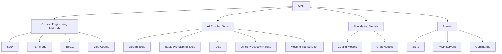
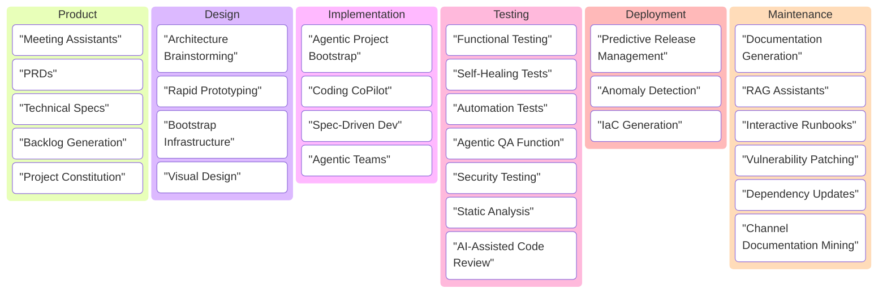
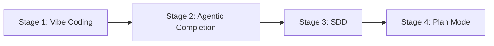

# Reference Architecture: AI‑Native SDLC (AINE)

This document describes a **reference architecture for AI‑Native Engineering** (abbreviated "AINE" herein) — how to redesign the software delivery lifecycle so that AI is a **first‑class participant**.

It is intentionally **capability‑first** (what AI enables across the SDLC) rather than a fixed shopping list of tools. Tool examples are included to make the architecture concrete.

## The AINE Building Blocks

This diagram describes the fundamental building blocks in enabling an organization to transition to working AI-natively.

In order to have a productive approach to AINE, an enterprise needs to consider each of these areas:
- **Context Engineering Methods**: How will the organization manage the context needed for an agent to build successfully with AI.
- **AI-Enabled Tools**: What suite of existing off-the-shelf tools can the organisation either procure, or enable the AI functionality within, in order to move faster.
- **Foundation Models**: Does the organization want to standardise on one suite of Foundation Models, and is the risk profile of the business such that a public model is an option, do they need to use a private model catalog on a hyperscaler, or do they need to host their own?
- **Agents**: How will the coding & document authoring agents within the enterprise utilise a secure connectivity layer to maximise the context available to them when developing.

This reference will dive deeper into each of these topics.  

---

## Where AI assists in the SDLC (capabilities)

### 1) Product
- Capture and structure early discovery (meeting transcripts → decisions → PRDs).
- Convert intent into backlog (epics/stories, acceptance criteria, constraints).
- Reduce "Sprint 0" overhead by generating first‑pass specs and risk registers.

### 2) Design
- Rapid UI/flow prototyping, early stakeholder alignment.
- Architecture exploration: decomposition, data flows, threat models, ADRs.
- Option generation: compare alternatives with explicit trade‑offs.

### 3) Implementation
- Bootstrapping: create skeletons aligned to your stack and conventions.
- Vibe Coding (tactical): inline completions and small refactors.
- Spec‑Driven Development (strategic): generate work backlogs from structured specs.
- Agentic delivery: agents implement bounded tasks with human review gates.

### 4) Testing
- Generate unit/integration/e2e tests from requirements + code.
- "Self‑healing" and robustness improvements (reduce flaky maintenance).
- Security assistance: SAST explanations + patch suggestions + regression tests.
- AI-assisted code review: as AI-native development increases the pace of PRs and artifacts, AI can help reviewers keep up by summarising changes, flagging risks, and checking against specs.

### 5) Deployment
- IaC generation grounded in internal patterns (Terraform modules, policies).
- Environment drift detection, safe rollout plans, release notes.
- Operational readiness: runbooks, dashboards, on‑call playbooks.

### 6) Maintenance
- Conversational ops: query logs/metrics and correlate incidents.
- RAG over internal docs + code + tickets. Also valuable for onboarding: new team members can query indexed Slack/Teams history, past decisions, and tribal knowledge instead of searching manually.
- Channel documentation mining: watch Slack/Teams channels for valuable project information, harvesting potential documentation and indexing content for future questions.
- Continuous dependency hygiene: upgrades, patches, verification.
- Modernisation: adding tests, mapping blast radius, incremental migrations.

---

## Context Engineering Methods

Context Engineering is the techniques used to right-size context such that a coding model has all the relevant information to complete a task. 
This can include architectural preferences, requirements, acceptance criteria, visual references via designs, along with preferences for things like coding standards. 

### Stage 1: Vibe Coding

Most developer's first experience with Context Engineering comes from experimenting with Vibe coding.
It is conceivably possible - albeit extremely unlikely - to context engineer a perfect enterprise software masterpiece in a one-shot vibe coded prompt. 
This has lead us to develop frameworks which assist the model in including the most relevant pieces of context available for the task at hand. 
Tactical autocomplete / chat‑driven coding. Useful for small, bounded tasks, but it does not scale without the other context engineering techniques.

### Stage 2: Agentic Completion

A natural next step is to use the built-in Agent mode that comes with most AI-enabled IDEs. This can enables teams to complete discrete changes across several files, but often struggles to scale. The model can often get stuck in debugging loops, or fail to complete tasks successfully. 

### SDD (Spec‑Driven Development)

SDD is the core Context Engineering lever for engineering teams looking to make the next evolution in context engineering maturity. The source of truth becomes *written specs* (PRD/architecture/story spec), rather than a chat thread.

**Artifacts (typical):**
- **Project constitution:** non‑negotiables (security, testing, style, deployment).
- **PRD:** problem, users, requirements, constraints, success metrics.
- **Architecture:** Logical structure, architectural preferences, tech stack of choice, service boundaries.
- **Story specs:** per‑story markdown with requirements & acceptance criteria.

### EPCC

A repeatable loop for producing reliable outputs from AI systems - **E**xplore, **P**lan, **C**reate, **C**heck. Promoted by AWS in learning material, but functionality extremely similar to SDD above. 

### Plan Mode

At it's core, Plan Mode requires the model to propose a plan (tasks, risks, assumptions) *before* writing/altering code. This creates a checkpoint where humans can validate approach before implementation begins.
The use of Plan mode can be viewed as an alternative to authoring lengthy specs, instead forcing the model to jump straight to the definition of a backlog work item. 
Plan mode requires great context engineering maturity - and is a potential graduation path from Spec Driven Development for high-performing teams who have managed the art of context engineering & right-sizing the information a model needs to be successful in a task. 

---

## AI Enabled Tools

### Design Tools

UI generation, journey mapping, architecture diagramming, ADR drafting. These tools produce **artifacts** (PRDs, ADRs, wireframes) that feed Context Engineering.

Capabilities:
- Rapid UI/flow prototyping, early stakeholder alignment.
- Architecture exploration: decomposition, data flows, threat models.
- Option generation: compare alternatives with explicit trade‑offs.

### Rapid Prototyping (Bolt/Lovable/etc.)

Tools like Bolt, Lovable, v0, etc. Use deliberately:
- Great for **UI exploration and stakeholder alignment**.
- Treat output as **throwaway prototypes** unless you're prepared to harden it.
- If you keep it, ingest it as **brownfield**: add tests, codify standards, refactor to your architecture.

### IDEs (Agentic IDEs)

Next‑generation IDEs are not "better autocomplete"; they are **workflow orchestration surfaces**:
- Specs in‑editor
- Task graphs and work logs
- Integrated test/run/trace loops
- Repository‑wide context management

**Tool examples:**
- **Amazon Kiro** - Great tool for spec-driven development with built-in requirements, design docs, and task/backlog workflows.
- **Cursor** - Powerful agentic IDE with Plan mode increasingly converging on spec-driven primitives.
- **Visual Studio Code** - Excellent integration with AI tools and extensions for spec-driven connectivity.

**Practical advice:**
- Standardise **rules** (CursorRules / IDE rules) at repo + org level.
- Require agents to emit **work logs** and link to specs/decisions.

### Office Productivity Suite

AI-enabled document editing, spreadsheet analysis, and presentation generation. These tools help with:
- PRD and spec drafting
- Data analysis and reporting
- Stakeholder communication materials

### Transcription / Meeting Intelligence

- Best‑in‑class output matters because these artifacts become **upstream context** for specs.
- Enterprise considerations: retention, redaction, PII handling, "train on your data" defaults, and admin controls.
- Some tools offer a RAG-like store of previous meeting context which can be searched over & new output generated - this proves very useful longitudinally.

**Tool examples:**
- **Granola** - Particularly useful for its RAG-like database where you can ask questions of previous meetings and search history.
- **Zoom AI Companion** - Built-in transcription and meeting summaries.
- **Microsoft Teams Transcripts** - Native transcription integrated with the Teams ecosystem.

### Channel Documentation / Knowledge Mining

Tools that watch Slack/Teams channels and harvest valuable project information. These help with:
- Indexing content for future questions using RAG (Retrieval Augmented Generation)
- Onboarding bots that new team members can query for tribal knowledge
- Surfacing past decisions and discussions without manual searching

**Tool examples:**
- **Slack AI** - Native search and summarization across Slack channels and history.
- Custom RAG solutions built on conversation exports and vector databases.

### Interactive Runbooks

When systems go down, having AI-assisted runbooks becomes critically important. These tools help on-call engineers diagnose and resolve issues faster.

**Tool examples:**
- **ChatGPT GPTs** - Custom GPTs configured with runbook knowledge and troubleshooting procedures.
- **Gemini Gems** - Google's equivalent for creating specialized assistants with operational knowledge.
- **Claude Projects** - Anthropic's project-based context for embedding runbook documentation.

---

## Foundation Models

Choose the model **and** the operating model (privacy, latency, cost, governance).

### Coding Models

Models optimized for code generation, completion, and understanding. These power IDE copilots, code review assistance, and implementation agents.

### Chat Models

General-purpose conversational models for spec drafting, brainstorming, documentation, and analysis tasks.

### Public LLM vs private endpoints vs dedicated/on‑prem

**Decision axes:**
- **Data sensitivity:** what can leave your network?
- **Auditability:** do you need event logs, retention, DLP?
- **Cost controls:** per‑token sprawl vs pooled budget.

**Reference options:**
- **Public API (fastest to adopt):** OpenAI/Anthropic public endpoints.
- **Private endpoints (enterprise default):** Azure OpenAI / AWS Bedrock / GCP Vertex with private networking.
- **Dedicated/on‑prem (regulated):** open‑weights deployed in VPC/on‑prem with strict egress and capacity planning.

> Rule of thumb: start with the *lightest* trust profile that meets your constraints, then raise trust controls as you scale.

---

## Agents

Agents are AI systems that can take autonomous action within defined boundaries. They require careful governance and clear scope.

### Skills

Reusable, composable capabilities that agents can invoke. Skills encapsulate domain knowledge and task patterns that can be shared across projects and teams.

### MCP Servers

Model Context Protocol (MCP) turns tools into **typed, permissioned capabilities**.

**What changes architecturally:**
- Your "agent" stops being a blob of prompts and becomes an application that can call **tools with explicit interfaces**.
- You can apply **security and governance** at the tool boundary (not just in prompt text).

**Best practices:**
- Run MCP servers **inside your trust boundary** (VPC/on‑prem) where possible.
- Use **least privilege**: separate tokens per tool and per environment (dev/stage/prod).
- Put MCP behind **authn/z** (mTLS/OIDC), with per‑tool allowlists.
- Add **auditing**: log tool calls with inputs/outputs (redact secrets), user, repo, and ticket/spec reference.
- Rate limit and sandbox: treat MCP as part of your **attack surface**.

**Common MCP server examples:**
- **Jira** - Issue tracking and backlog synchronization.
- **Confluence** - Documentation and knowledge base access.
- **Azure DevOps** - Work items, pipelines, and repository integration.
- **Figma** - Design asset access and design-to-code workflows.
- **Microsoft Teams** - Communication and collaboration context.
- **AWS** - Cloud infrastructure management and resource access.

### Commands

Predefined agent workflows triggered by explicit user invocation. Commands provide predictable, repeatable agent behaviors for common tasks.

### Autonomous agent roles (example)

Role‑based agents reduce context overload and increase predictability:
- **Product agent:** PRD drafts, user journeys, requirements.
- **Technical director agent:** architecture docs, ADRs, interfaces.
- **Engineer agents (FE/BE):** implementation tasks with tests.
- **QA agent:** test plans, e2e generation, regression triage.
- **Release agent:** changelogs, rollout plans, checks.

Each agent has:
- a bounded scope,
- required inputs (specs),
- allowed tools (MCP),
- and output contracts (work logs, tests, docs).

---

## Governance & trust (Human‑in‑the‑loop)

Trust isn't a vibe; it's engineered.

Controls to build trust across the SDLC:
- **Spec gates:** no code generation without an approved story spec.
- **Determinism:** require "diff‑only" changes for certain tasks.
- **Policy as code:** linting, formatting, SAST, secrets scanning.
- **Provenance:** trace outputs back to prompts/specs/inputs.
- **Environment separation:** sandbox vs staging vs prod credentials.
- **Review model:** humans review changes; agents don't merge to main unassisted.

---

## Rollout strategy: enterprise‑wide vs domain pilots

Observed patterns across client rollouts:

1) **Enterprise‑wide enablement (broad + shallow)**
- Roll out IDE copilots, basic doc summarisation, lightweight test generation.
- Produces **marginal but real** gains (often ~10% productivity).
- Good for baseline competence; rarely transformational.

2) **Domain‑level acceleration (narrow + deep)**
- Pick a project/domain well‑suited to AI‑native delivery (greenfield build, modernisation).
- Invest in **context engineering** (specs, architecture, conventions), **agentic workflows**, and CI/CD integration.
- Can yield **3–5× acceleration** with better quality (tests, documentation, consistency).

Recommended rollout: **start narrow and deep**, prove ROI with measurable guardrails, then scale horizontally.

---

## Reference architectures by trust profile

### 1) Progressive startup (low friction)
- **LLM:** Public APIs (OpenAI/Anthropic).
- **IDE:** Agentic IDE (Cursor‑class) + repo rules.
- **SDD:** Lightweight but real specs (PRD + story specs).
- **Ops:** Basic audit logs, CI gates, secrets scanning.

### 2) Enterprise (private endpoints)
- **LLM:** Bedrock/Azure OpenAI/Vertex via private networking.

Cloud mapping (illustrative):
- **AWS:** Bedrock (models) + IAM/STS (auth) + PrivateLink/VPC endpoints (network) + CloudWatch/OpenSearch (telemetry)
- **Azure:** Azure OpenAI + Entra ID (auth) + Private Link + Log Analytics
- **GCP:** Vertex AI + IAM + Private Service Connect + Cloud Logging
- **IDE:** VS Code/Cursor‑class with org rules + telemetry controls.
- **MCP:** Hosted in VPC; separate credentials per tool/env.
- **Governance:** stronger audit, DLP, policy‑as‑code, prompt/provenance logging.

### 3) Highly regulated industry (data sovereignty)
- **LLM:** Dedicated deployment (VPC/on‑prem) of open‑weights or approved vendor.
- **IDE:** Locked‑down tooling; offline‑capable flows where needed.
- **MCP:** Strict allowlists, isolated tool runtimes, full audit trails.
- **Change control:** enforced stage gates, mandatory human approvals, reproducible builds.

---

## Appendix: original notes dump

The original Google Doc export was captured in the initial commit for traceability.
