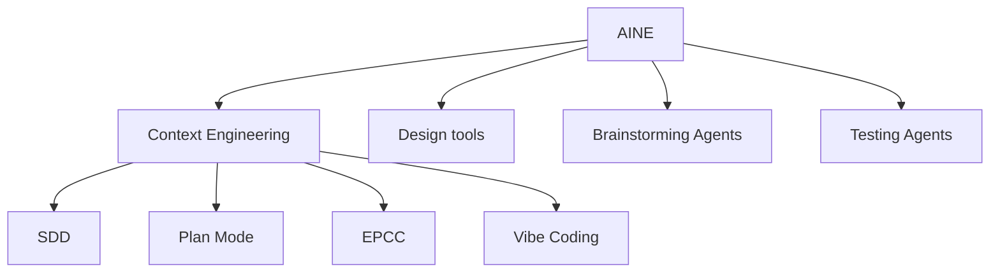

# Reference Architecture: AI‑Native SDLC (AINE)

This document describes a **reference architecture for AI‑Native Engineering**—how to redesign the software delivery lifecycle so that AI is a **first‑class participant**.

It is intentionally **capability‑first** (what AI enables across the SDLC) rather than a fixed shopping list of tools. Tool examples are included to make the architecture concrete.

## AINE taxonomy (doctrine)

Key point: **Enabling Copilot/Cursor is not an AINE strategy.** That’s *one leaf* (Vibe Coding) under Context Engineering. AINE is the whole tree: specs, roles, agents, tools, and governance.

---

## Rollout strategy: enterprise‑wide vs domain pilots

Observed patterns across client rollouts:

1) **Enterprise‑wide enablement (broad + shallow)**
- Roll out IDE copilots, basic doc summarisation, lightweight test generation.
- Produces **marginal but real** gains (often ~10% productivity).
- Good for baseline competence; rarely transformational.

2) **Domain‑level acceleration (narrow + deep)**
- Pick a project/domain well‑suited to AI‑native delivery (greenfield build, modernisation, “gnarly” repetitive workflows).
- Invest in **context engineering** (specs, architecture, conventions), **agentic workflows**, and CI/CD integration.
- Can yield **3–5× acceleration** with better quality (tests, documentation, consistency).

Recommended rollout: **start narrow and deep**, prove ROI with measurable guardrails, then scale horizontally.

---

## Where AI assists in the SDLC (capabilities)

### 1) Planning
- Capture and structure early discovery (meeting transcripts → decisions → PRDs).
- Convert intent into backlog (epics/stories, acceptance criteria, constraints).
- Reduce “Sprint 0” overhead by generating first‑pass specs and risk registers.

### 2) Design
- Rapid UI/flow prototyping, early stakeholder alignment.
- Architecture exploration: decomposition, data flows, threat models, ADRs.
- Option generation: compare alternatives with explicit trade‑offs.

### 3) Implementation
- Bootstrapping: create skeletons aligned to your stack and conventions.
- Vibe Coding (tactical): inline completions and small refactors.
- **Spec‑Driven Development (strategic):** generate work from structured specs.
- Agentic delivery: agents implement bounded tasks with human review gates.

### 4) Testing
- Generate unit/integration/e2e tests from requirements + code.
- “Self‑healing” and robustness improvements (reduce flaky maintenance).
- Security assistance: SAST explanations + patch suggestions + regression tests.

### 5) Deployment
- IaC generation grounded in internal patterns (Terraform modules, policies).
- Environment drift detection, safe rollout plans, release notes.
- Operational readiness: runbooks, dashboards, on‑call playbooks.

### 6) Maintenance
- Conversational ops: query logs/metrics and correlate incidents.
- RAG over internal docs + code + tickets.
- Continuous dependency hygiene: upgrades, patches, verification.
- Modernisation: adding tests, mapping blast radius, incremental migrations.

---

## Tooling layers

### Context Engineering (the core)

Context Engineering is how you make AI outputs **predictable**: you shape the inputs, constraints, and workflow so the model is doing bounded work.

Core techniques in this doctrine:
- **SDD (Spec‑Driven Development):** the source of truth is *written specs* (PRD/architecture/story spec), not a chat thread.
- **Plan Mode:** require the model to propose a plan (tasks, risks, assumptions) *before* writing/altering code.
- **EPCC:** a repeatable loop for producing reliable outputs from AI systems:
  - **E**xplore (clarify intent, gather context)
  - **P**lan (produce a concrete plan and acceptance criteria)
  - **C**reate (implement in small, reviewable increments)
  - **C**heck (tests, linters, policy gates, human review)
- **Vibe Coding:** tactical autocomplete / chat‑driven coding. Useful, but it does not scale without the other techniques.

### Foundation models & chat
Choose the model **and** the operating model (privacy, latency, cost, governance).

#### Public LLM vs private endpoints vs dedicated/on‑prem
**Decision axes**
- **Data sensitivity:** what can leave your network?
- **Auditability:** do you need event logs, retention, DLP?
- **Latency & availability:** interactive IDE vs batch jobs.
- **Cost controls:** per‑token sprawl vs pooled budget.

**Reference options**
- **Public API (fastest to adopt):** OpenAI/Anthropic public endpoints.
- **Private endpoints (enterprise default):** Azure OpenAI / AWS Bedrock / GCP Vertex with private networking.
- **Dedicated/on‑prem (regulated):** open‑weights deployed in VPC/on‑prem with strict egress and capacity planning.

> Rule of thumb: start with the *lightest* trust profile that meets your constraints, then raise trust controls as you scale.

### Transcription / meeting intelligence
- Best‑in‑class output matters because these artifacts become **upstream context** for specs.
- Enterprise considerations: retention, redaction, PII handling, “train on your data” defaults, and admin controls.

### Rapid prototyping (Bolt/Lovable/etc.)
Use deliberately:
- Great for **UI exploration and stakeholder alignment**.
- Treat output as **throwaway prototypes** unless you’re prepared to harden it.
- If you keep it, ingest it as **brownfield**: add tests, codify standards, refactor to your architecture.

### Spec‑Driven Development (SDD)
SDD is the core Context Engineering lever.

Artifacts (typical):
- **Project constitution:** non‑negotiables (security, testing, style, deployment).
- **PRD:** problem, users, requirements, constraints, success metrics.
- **Architecture + ADRs:** system boundaries, interfaces, trade‑offs.
- **Story specs:** per‑story markdown with acceptance criteria + test intent.

Workflow pattern:
1. Human clarifies intent and constraints.
2. AI drafts specs (bounded) → human edits.
3. AI implements tasks **only against specs**.
4. CI + review gates validate outputs.

### Next‑generation IDEs (agentic IDEs)
These are not “better autocomplete”; they are **workflow orchestration surfaces**:
- Specs in‑editor
- Task graphs and work logs
- Integrated test/run/trace loops
- Repository‑wide context management

Practical advice:
- Standardise **rules** (CursorRules / IDE rules) at repo + org level.
- Require agents to emit **work logs** and link to specs/decisions.

### MCP servers (tool integration)
Model Context Protocol (MCP) turns tools into **typed, permissioned capabilities**.

What changes architecturally:
- Your “agent” stops being a blob of prompts and becomes an application that can call **tools with explicit interfaces**.
- You can apply **security and governance** at the tool boundary (not just in prompt text).

Best practices:
- Run MCP servers **inside your trust boundary** (VPC/on‑prem) where possible.
- Use **least privilege**: separate tokens per tool and per environment (dev/stage/prod).
- Put MCP behind **authn/z** (mTLS/OIDC), with per‑tool allowlists.
- Add **auditing**: log tool calls with inputs/outputs (redact secrets), user, repo, and ticket/spec reference.
- Rate limit and sandbox: treat MCP as part of your **attack surface**.

---

## Governance & trust (Human‑in‑the‑loop)

Trust isn’t a vibe; it’s engineered.

Controls to build trust across the SDLC:
- **Spec gates:** no code generation without an approved story spec.
- **Determinism:** require “diff‑only” changes for certain tasks.
- **Policy as code:** linting, formatting, SAST, secrets scanning.
- **Provenance:** trace outputs back to prompts/specs/inputs.
- **Environment separation:** sandbox vs staging vs prod credentials.
- **Review model:** humans review changes; agents don’t merge to main unassisted.

---

## Design tools / Brainstorming agents / Testing agents

These are the other three AINE branches that typically get overlooked when teams focus only on IDE copilots.

- **Design tools:** UI generation, journey mapping, architecture diagramming, ADR drafting.
- **Brainstorming agents:** domain research, option generation, risk discovery, “red team” review of plans/specs.
- **Testing agents:** test plan creation, coverage targeting, regression triage, flaky test isolation, security test generation.

In practice, you’ll get the most leverage when these agents produce **artifacts** (PRDs, ADRs, test plans) that feed Context Engineering.

## Autonomous agent roles (example)

Role‑based agents reduce context overload and increase predictability:
- **Product agent:** PRD drafts, user journeys, requirements.
- **Technical director agent:** architecture docs, ADRs, interfaces.
- **Engineer agents (FE/BE):** implementation tasks with tests.
- **QA agent:** test plans, e2e generation, regression triage.
- **Release agent:** changelogs, rollout plans, checks.

Each agent has:
- a bounded scope,
- required inputs (specs),
- allowed tools (MCP),
- and output contracts (work logs, tests, docs).

---

## Reference architectures by trust profile

### 1) Progressive startup (low friction)
- **LLM:** Public APIs (OpenAI/Anthropic).
- **IDE:** Agentic IDE (Cursor‑class) + repo rules.
- **SDD:** Lightweight but real specs (PRD + story specs).
- **Ops:** Basic audit logs, CI gates, secrets scanning.

### 2) Enterprise (private endpoints)
- **LLM:** Bedrock/Azure OpenAI/Vertex via private networking.

Cloud mapping (illustrative):
- **AWS:** Bedrock (models) + IAM/STS (auth) + PrivateLink/VPC endpoints (network) + CloudWatch/OpenSearch (telemetry)
- **Azure:** Azure OpenAI + Entra ID (auth) + Private Link + Log Analytics
- **GCP:** Vertex AI + IAM + Private Service Connect + Cloud Logging
- **IDE:** VS Code/Cursor‑class with org rules + telemetry controls.
- **MCP:** Hosted in VPC; separate credentials per tool/env.
- **Governance:** stronger audit, DLP, policy‑as‑code, prompt/provenance logging.

### 3) Highly regulated industry (data sovereignty)
- **LLM:** Dedicated deployment (VPC/on‑prem) of open‑weights or approved vendor.
- **IDE:** Locked‑down tooling; offline‑capable flows where needed.
- **MCP:** Strict allowlists, isolated tool runtimes, full audit trails.
- **Change control:** enforced stage gates, mandatory human approvals, reproducible builds.

---

## Appendix: original notes dump

The original Google Doc export was captured in the initial commit for traceability.
